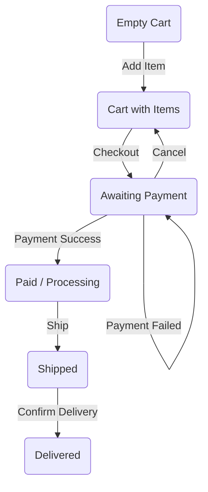

# 🧠 Test Design Analysis (Joom Project)

This document describes the test design logic applied to optimize test coverage for the Joom e-commerce platform.

---

## 1. Equivalence Partitioning (EP)
**Module:** Catalog Price Range Filter  
**Tests:** #15, #17, #18

*   **Valid Partition:** Values from 10.00 to 10,000.00. 
*   **Invalid Partition (Below Min):** Values less than 10.00.
*   **Invalid Partition (Above Max):** Values greater than 10,000.00.
*   **Invalid Partition (Above Max):** Values greater than 10,000.00.
*   **Zero Value Handling** Verification of system logic when price is 0.00.
*   **Non-Numeric Partition:** Any non-numeric characters. 
   
---

## 2. Boundary Value Analysis (BVA)
**Module:** Catalog Price Range Filter  
**Tests:** #16

### Lower Boundary (10.00 ₽)
*   **9.99** (Invalid Out): Just below the minimum limit.
*   **10.00** (Valid On): Exactly at the minimum limit.
*   **10.01** (Valid In): Just above the minimum limit.

### Upper Boundary (10,000.00 ₽)
*   **9,999.99** (Valid In): Just below the maximum limit.
*   **10,000.00** (Valid On): Exactly at the maximum limit.
*   **10,000.01** (Invalid Out): Just above the maximum limit.

---

## 3. Decision Table: Promo Code Logic
**Module:** Coupon & Discount Calculation  
**Tests:** #25, #26, #27, #28

| Conditions | TC-25 | TC-26 | TC-27 | TC-28 |
| :--- | :---: | :---: | :---: | :---: |
| First Order | Yes | No | No | No |
| Brand "Uniqlo" | - | Yes | Yes | - |
| Quantity >= 2 | - | Yes | No | - |
| Category "Sport" | - | - | - | Yes |
| **Resulting Action** | **10% OFF** | **40% OFF** | **No Disc.** | **11% OFF** |

---

## 4. State Transition Testing: Order Lifecycle
**Module:** Checkout & Order Management  
**Tests:** #32, #33

Verified status flow integrity from cart creation to final delivery using a State Transition Table.

---

## 🔍 Summary
*   **EP:** Verified system handling of valid, invalid, and non-numeric data types.
*   **BVA:** Identified critical validation bypasses at 9.99 and 10,000.01 limits.
*   **Decision Table:** Confirmed logical consistency for complex promo rules.
*   **State Transition:** Ensured data integrity throughout the order lifecycle.
